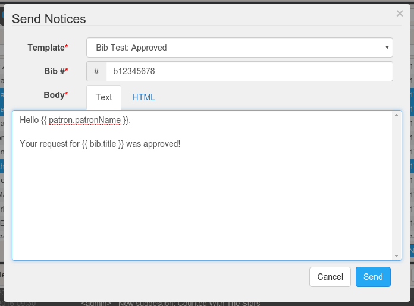

# suggestion-notifier




Notify patrons via templated emails when their purchase suggestions are ordered, denied, etc.

Currently supports the Millennium ILS and Sierra LSP.

## Getting Started

Assuming you have Node.js and NPM available:
```
git clone https://github.com/alivesay/suggestion-notifier.git
npm install -g gulp bower
bower install
./node_modules/sequelize-cli/bin/sequelize db:migrate
./node_modules/sequelize-cli/bin/sequelize db:seed
gulp
```

## Edit `server/config/settings.js`:

* `ilsOptions:` - ILS/LSP configuration settings.  *Note: these will be stored in the database and configurable through UI in a later release.*
    * `catalog:`
        * `hostname:` - FQDN of your Millennium/Sierra app server
        * `patronAPISSLPort:` - SSL port for the Patron API (Default: `54620`)
    * `itemTypes:` - key/value map for item types mapping item identifiers to display text (eg, {book: 'Book'})
    * `locations:` - key/value map for locations mapping location identifiers to display text (eg, {central: 'Central'})

*  `notices:` - various notification settings
    *  `fromAddress:` - *From:* address for email notices sent to patrons
    *  `subjectPrefix:` - *Subject:* for email notices sent to patrons (Default: `Purchase Suggestion Notice`)

* `auth:`
    * `key:` - private key for JWT signing
    * `tokenTTL:` - JWT token lifespan in seconds (Default: `86400`)
    * `useLDAP:` - set to `true` to use LDAP authentication  (Default: `false`)
    * `ldap:` - used when `useLDAP` is `true`
        * `server:` - LDAP server FQDN
        * `port:` - LDAP server port
        * `rootDN:` - top-level distinguised name to search for usernames (by `ldapFilterAttribute`)
        * `serviceAccountDN:` - LDAP bind account used to find users
        * `serviceAccountDN:` - LDAP bind account password
        * `ldapFilterAttribute:` - attribute filter for user search (Default: `sAMAccountName`)
        * `rejectUnauthorized:` - set to `true` to ignore invalid LDAP TLS/SSL sessions (Default: `false`)

* `hapi:` - settings for Hapi/Mentat. See [hapi](https://github.com/hapijs/hapi) documentation for more options.
    *  `serverOptions:`
        *   `connectionOptions:` - see [hapi](https://github.com/hapijs/hapi) documentation for more options
            * `host:` - IP address to listen on (Default: `0.0.0.0`)
            * `port:` - port to listen on (Default: `8080`)
    * `pluginOptions:` - configures logging
* `nodemailerOptions:` - see [nodemailer](https://github.com/nodemailer/nodemailer) docs for more options
    * `host:` - mailserver host to use (Default: `127.0.0.1`)
    * `post:` - mailserver port to use (Default: `25`)

## Creating Templates

Click the gear icon to manage notification templates.  The following values are available for use within your templates:
```
patron.patronName
patron.emailAddress
patron.homeLibrary

suggestion.title
suggestion.author
suggestion.patron
suggestion..publisher
suggestion.isbn
suggestion.type
suggestion.subject
suggestion.type
suggestion.price
suggestion.notes

bib.title
bib.recordURI
```
