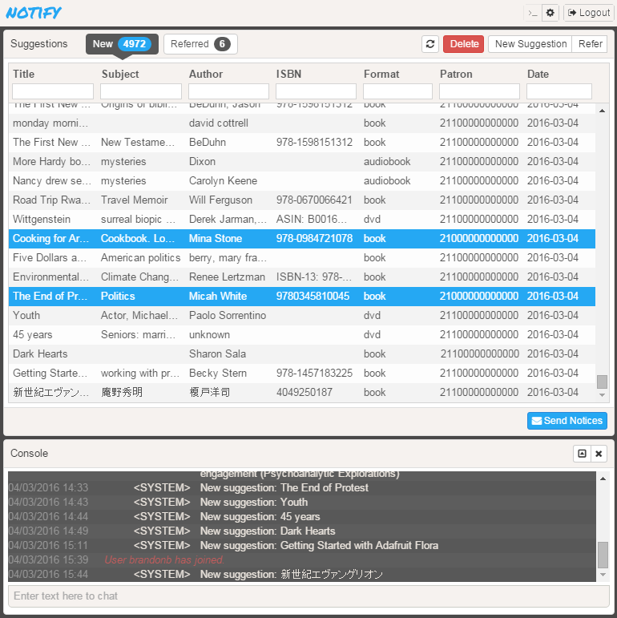

# suggestion-notifier



Notify patrons via templated emails when their purchase suggestions are ordered, denied, etc.

Currently supports the Millennium ILS and Sierra LSP.

## Getting Started

Assuming you have Node.js and NPM available:
```
git clone https://github.com/alivesay/suggestion-notifier.git
npm install -g gulp bower
bower install
./node_modules/sequelize-cli/bin/sequelize db:migrate
./node_modules/sequelize-cli/bin/sequelize db:seed
gulp
```
